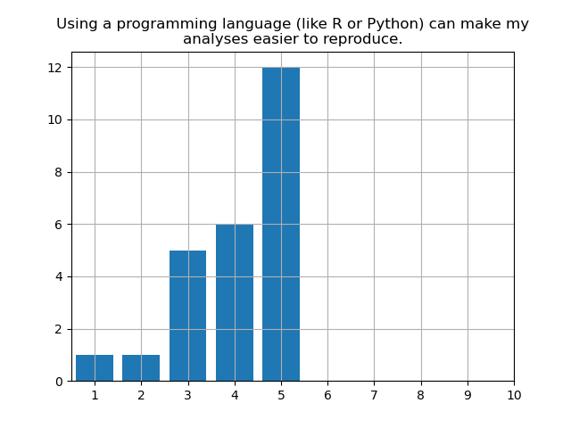

This course is aimed towards the Master students of the various Biology curricula of the University
of Vienna. The course makeup is overwhelmingly (90%) MSc students, with some PhD students attending.
Most students will not have any real programming experience, with only ~10-15% of them having
attended an intro to R or Python course. A broader part of the audience may have had some
introduction to statistics, or been exposed to bioinformatics of some sort (30-40%). Still, the
students are not confident in their programming proficiency:

Similarly, even if they do know how to program a bit, they do not know how to organize their code in
scripts or programs to solve a particular problem:

A frustration that is voiced often in the course is that the students feel they don't know where to
even start when it comes to solving a problem, be it technical or conceptual. This frustration, in
my experience, often mutates into a fear of trying, something that needs to be taken into account,
especially when we get started on Rosalind/Advent of Code.

+---------------------------------------+------------------------------------------------+
|                                       |                                                |
+=======================================+================================================+
|                |                               |
+---------------------------------------+------------------------------------------------+

At the very least, the students seem somewhat convinced that using programming can help them be more
efficient when working with data, or their analyses easier to reproduce. A less charitable reading
of this distribution would be that the students are undecided on this topic, yet still slightly
mistrustful.

+---------------------------------------+------------------------------------------------+
|                                       |                                                |
+=======================================+================================================+
|                |                    |
+---------------------------------------+------------------------------------------------+

This part of the course follows bash literacy and introduction to version control; its aim is mostly
to teach the students algorithmic thought, problem solving, and Python syntax. In particular, after
conquering the basics of Python syntax, the students will experience the following loop multiple
times:

1. Encounter a new problem.
2. Understand the problem by breaking it down, comparing to solved problems, or drawing from previous knowledge/first principles.
3. Formulate clear solution objectives.
4. Sketch a solution algorithm (theoretical solution).
5. Translate the algorithm to Python.
6. Overcome logical/syntax errors; iterate and improve on solution.
7. Validate solution.
8. Look back.
9. Log solution with a version-control system.

The experience of overcoming multiple unknown problem settings will slowly build confidence in the
students. Furthermore, they will practice cooperation and improve their code comprehension skills by
interacting with their colleagues and the instructor.

This course will help the students build a new, healthy relationship with programming, upon which
their future interactions can be based. It will also teach them the basics of Python programming,
versing them in a popular and well-supported programming language with direct applications in the
life sciences.